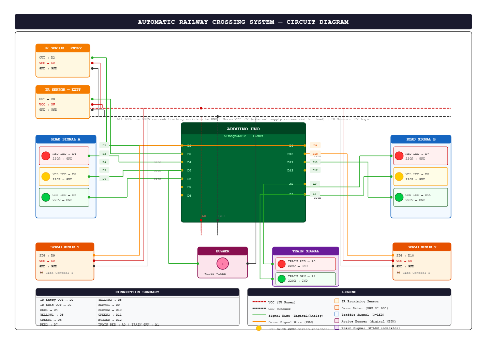

# 🚆 Automatic Railway Crossing System using Arduino

## Overview

The Automatic Railway Crossing System is an Arduino-based smart railway safety project that automatically controls railway gates, road traffic signals, warning lights, buzzer alerts, and train signals using IR sensors and servo motors.

The system detects an approaching train using an Entry IR Sensor and automatically closes the railway crossing gate. While the train passes, warning lights flash and a buzzer sounds to alert road users. Once the train reaches the Exit IR Sensor, the gates reopen and normal traffic flow resumes.


## Features

* Automatic train detection using IR sensors
* Automatic gate control using servo motors
* Railway crossing warning buzzer
* Alternating red warning lights
* Road traffic signal control
* Train signal control
* Entry and Exit sensor based operation
* Real-time railway crossing automation


## Components Used

| Component         | Quantity    |
| ----------------- | ----------- |
| Arduino Uno       | 1           |
| IR Sensor Modules | 2           |
| Servo Motors      | 2           |
| Red LEDs          | 3           |
| Green LEDs        | 3           |
| Yellow LEDs       | 2           |
| Buzzer            | 1           |
| 220Ω Resistors    | Multiple    |
| Jumper Wires      | As Required |
| Breadboard        | 1           |
| Power Supply      | 5V          |


## Pin Connections

### IR Sensors

| Device       | Arduino Pin |
| ------------ | ----------- |
| Entry Sensor | D2          |
| Exit Sensor  | D3          |

### Road Traffic Signals

| Signal   | Arduino Pin |
| -------- | ----------- |
| Red 1    | D4          |
| Yellow 1 | D5          |
| Green 1  | D6          |
| Red 2    | D7          |
| Yellow 2 | D8          |
| Green 2  | D11         |

### Railway Gates

| Servo        | Arduino Pin |
| ------------ | ----------- |
| Gate Servo 1 | D9          |
| Gate Servo 2 | D10         |

### Alerts

| Device | Arduino Pin |
| ------ | ----------- |
| Buzzer | D12         |

### Train Signal

| Signal      | Arduino Pin |
| ----------- | ----------- |
| Train Red   | A0          |
| Train Green | A1          |


## Working Principle

### Normal Condition

* Railway gates remain open.
* Road traffic signals remain green.
* Train signal remains green.
* Buzzer remains off.

### Train Detection

When the Entry IR Sensor (D2) detects a train:

1. Railway gates close automatically.
2. Road green signals turn off.
3. Red warning lights begin alternating.
4. Warning buzzer activates.
5. Train signal changes to red.

### Train Crossing

While the train is passing:

* Gates remain closed.
* Red warning lights continue flashing.
* Buzzer continues operating.

### Train Exit

When the Exit IR Sensor (D3) detects the train:

1. Gates open automatically.
2. Warning lights stop.
3. Buzzer turns off.
4. Road signals return to green.
5. Train signal returns to green.


## Circuit Diagram




## Project Structure

```text
automatic-railway-crossing-system/
│
├── Automatic_Railway_Crossing_System.ino
├── README.md
├── circuit-diagram.png
├── images/
│   ├── prototype.jpg
│   ├── working1.jpg
│   └── working2.jpg
└── LICENSE
```


## Future Improvements

* ESP32 IoT Monitoring
* GSM Alert System
* LCD Status Display
* Multiple Train Detection
* Cloud-Based Railway Monitoring
* Mobile Application Integration
* Ultrasonic Sensor Based Detection


## Applications

* Smart Transportation Systems
* Railway Safety Automation
* Educational Projects
* IoT and Embedded Systems Learning
* Smart City Demonstrations


## Author

**Mohammad Alquamah Ansari**

GitHub: https://github.com/alqamahansari

## License

This project is released under the MIT License.
